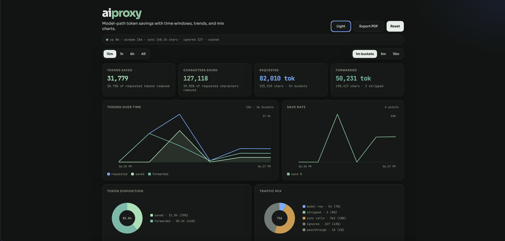
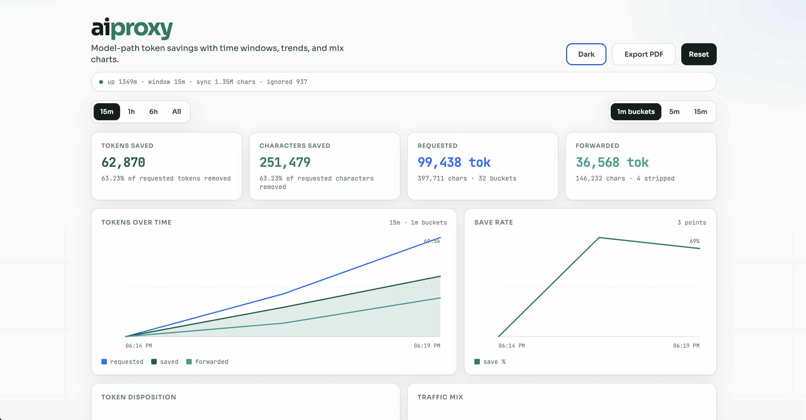

# aiproxy

Local proxy that sits between **Cursor** / **Claude Code** and the model APIs. It strips bulky / duplicate context from JSON requests to save tokens, then forwards the cleaned request upstream.

**Dashboard:** [http://tokensaver.local/](http://tokensaver.local/) (v2: [/v2](http://tokensaver.local/v2)) — tokens & characters requested, forwarded, and saved.

One-time setup (hosts entry + port-80 forward so you don’t type `:8081`):

```bash
sudo .venv/bin/python -m aiproxy --install-hostname
```

That maps `tokensaver.local` → `127.0.0.2` and forwards `:80` → whatever `dashboard_port` is in `config.yaml` (auto-detected; no reinstall when the port changes). Direct URL still works: `http://127.0.0.1:8081/`.

<table>
  <tr>
    <td align="center"></td>
    <td align="center"></td>
  </tr>
  <tr>
    <td align="center">Dark</td>
    <td align="center">Light</td>
  </tr>
</table>

> **Python note:** On macOS/Linux use **`python3`** to create the venv. After that, always run aiproxy with **`.venv/bin/python`** (not system `python` / `python3`) so deps resolve. Printable setup snippets already bake this in.
>
> **Windows:** see [README-Windows.md](README-Windows.md) (PowerShell paths, `.venv\Scripts\python.exe`, CA trust).

---

## 1. Install (once)

**Easiest:** double-click the start script (asks Cursor vs Claude, installs deps, starts proxy):

| OS | Script |
|----|--------|
| macOS | [`start-mac.command`](start-mac.command) |
| Windows | [`start-windows.bat`](start-windows.bat) |

Or manually:

```bash
cd ~/code/aiproxy
python3 -m venv .venv
.venv/bin/python -m pip install --upgrade pip
.venv/bin/python -m pip install -r requirements.txt
.venv/bin/python -m pip install -e .
```

Optional: `source .venv/bin/activate` — then bare `python` is the venv. Safest without activate:

```bash
.venv/bin/python -m aiproxy --dry-run
```

Print ready-to-copy install + connect snippets:

```bash
.venv/bin/python -m aiproxy --print-cursor-settings
.venv/bin/python -m aiproxy --print-claude-settings
```

---

## 2. Pick a mode

| Mode | Command | Best for | CA cert needed? |
|------|---------|----------|-----------------|
| **mitm** (default) | `.venv/bin/python -m aiproxy` | Cursor default models (HTTPS intercept) | Yes |
| **reverse** | `.venv/bin/python -m aiproxy --mode reverse` | Cursor BYOK **and** Claude Code (JSON strip) | No |
| **openai** | `.venv/bin/python -m aiproxy --mode openai` | Cursor OpenAI Base URL / BYOK only | No |
| **anthropic** | `.venv/bin/python -m aiproxy --mode anthropic` | Claude Code via `ANTHROPIC_BASE_URL` only | No |

**Recommendation**

- Cursor without BYOK → **mitm** (replies stream; protobuf bodies mostly passthrough)
- Claude Code / Cursor BYOK → **reverse** / **anthropic** / **openai** (real JSON stripping)

Start in dry-run first (logs savings, does **not** change bodies):

```bash
.venv/bin/python -m aiproxy --dry-run
```

When you’re happy with the dashboard numbers:

```bash
.venv/bin/python -m aiproxy
```

---

## 3. Connect Cursor (MITM — default models)

aiproxy streams SSE/Connect **responses** immediately (so replies work) and buffers agent **requests** to truncate large protobuf string fields (file dumps, tool output, etc.).

**Terminal 1**

```bash
cd ~/code/aiproxy
.venv/bin/python -m aiproxy --mode mitm --dry-run
```

**Trust the CA (macOS, once)**

```bash
sudo security add-trusted-cert -d -r trustRoot \
  -k /Library/Keychains/System.keychain \
  ~/.mitmproxy/mitmproxy-ca-cert.pem
```

**Cursor `settings.json`**

```json
{
  "http.proxy": "http://127.0.0.1:8080",
  "http.proxySupport": "override",
  "http.proxyStrictSSL": false,
  "cursor.general.disableHttp2": true
}
```

Fully quit Cursor (**Cmd+Q**), then relaunch with the CA for Node:

```bash
export NODE_EXTRA_CA_CERTS="$HOME/.mitmproxy/mitmproxy-ca-cert.pem"
open -a Cursor
```

Watch [http://127.0.0.1:8081/](http://127.0.0.1:8081/). You should see `api2.cursor.sh` / `api5.cursor.sh` traffic and replies should stream again.

**BYOK alternative:** `.venv/bin/python -m aiproxy --mode openai` + OpenAI Base URL `http://127.0.0.1:8080/v1` (JSON stripping; no CA).

---

## 4. Connect Claude Code (recommended)

**Terminal 1 — start reverse proxy**

```bash
cd ~/code/aiproxy
.venv/bin/python -m aiproxy --dry-run
```

**Terminal 2 — run Claude through it**

```bash
export ANTHROPIC_BASE_URL="http://127.0.0.1:8080"
# keep your existing key:
# export ANTHROPIC_API_KEY="sk-ant-..."
claude
```

Inside Claude, run `/status` and confirm the base URL is `http://127.0.0.1:8080`.

**Persist for every Claude session** — add to `~/.claude/settings.json`:

```json
{
  "env": {
    "ANTHROPIC_BASE_URL": "http://127.0.0.1:8080"
  }
}
```

Your API key stays wherever you already keep it (`ANTHROPIC_API_KEY` or Claude login). aiproxy forwards `x-api-key` / `Authorization` headers unchanged.

### What this does *not* cover

- **claude.ai** in the browser — not supported
- **Claude Desktop** — no supported Base URL hook; use Claude Code or MITM if you control the process env

---

## 5. Verify it’s working

| Check | Expected |
|-------|----------|
| Dashboard open | [http://127.0.0.1:8081/](http://127.0.0.1:8081/) loads |
| Send a chat in Cursor or Claude | **Requested** counters rise |
| Strip rules fire | **Saved** tokens/chars > 0 (or notes in dry-run logs) |
| `logs/` | `*.meta.json` before/after dumps when bodies change |

Safe rollout:

1. `--dry-run` → watch dashboard
2. Tune `config.yaml` → `strip` if needed
3. Restart **without** `--dry-run` to actually forward stripped bodies

---

## 6. What gets stripped

Configured in `config.yaml` under `strip:`

| Rule | Default idea |
|------|----------------|
| `max_messages` | Keep last N turns (+ system) |
| `max_chars_recent` / `max_chars_old` | Cap huge file dumps |
| `dedupe_file_blocks` | Collapse duplicate path/code blocks |
| `max_tool_result_chars` | Truncate old tool output |
| `drop_reasoning_parts` | Drop thinking/reasoning blobs |
| `compress_system` / `max_system_chars` | Shrink oversized system prompts (incl. Anthropic `system`) |
| `drop_keys` | Remove noisy JSON fields |

**Cursor (mitm):** agent paths (`AgentService`, `BidiService`, …) are Connect/protobuf. aiproxy buffers those **requests**, truncates large UTF-8 string fields in the protobuf wire format (no `.proto` files needed), and still **streams responses** so replies work. Telemetry paths stay passthrough.

**Claude / OpenAI reverse-proxy:** unchanged — JSON bodies only, via `--mode anthropic` / `openai` / `reverse`.

---

## 7. Ports & files

| What | Where |
|------|--------|
| Proxy | `127.0.0.1:8080` |
| Dashboard | `127.0.0.1:8081` |
| Config | `config.yaml` |
| Stats (persisted across launches) | `logs/stats.json` |
| Body dumps | `logs/` |
| mitmproxy CA | `~/.mitmproxy/mitmproxy-ca-cert.pem` |

---

## 8. Quick reference

```bash
# interactive install + start (macOS)
open start-mac.command
# Windows: double-click start-windows.bat

# or manually
cd ~/code/aiproxy
python3 -m venv .venv
.venv/bin/python -m pip install -r requirements.txt
.venv/bin/python -m aiproxy --mode mitm --dry-run

# Claude Code (anthropic reverse proxy)
.venv/bin/python -m aiproxy --mode anthropic --dry-run
export ANTHROPIC_BASE_URL=http://127.0.0.1:8080 && claude

# snippets
.venv/bin/python -m aiproxy --print-cursor-settings
.venv/bin/python -m aiproxy --print-claude-settings
```
